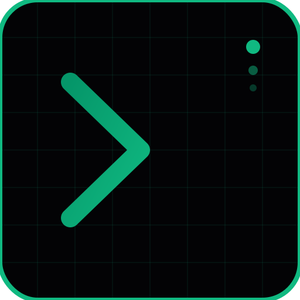

# 🌐 ISMAIL IBNE RATUL — CYBERSPACE DIGITAL OPERATING SYSTEM (OS)

<div align="center">
  
  <p><em>"An ultra-high-fidelity, zero-trust cyberpunk digital terminal and administrative operating portfolio."</em></p>
</div>

---

<div align="center">

[](https://github.com/im-ismail-ibne-ratul/portfolio/actions)
[](LICENSE)
[](SECURITY.md)
[](https://github.com/im-ismail-ibne-ratul/portfolio/actions)

[](https://im-ismail-ibne-ratul.github.io/)
[](https://im-ismail-ibne-ratul.github.io/)

</div>

---

## 🛠️ THE DEPLOYMENT ARCHITECTURE

The Cyberspace OS operates under strict automated continuous deployment (CI/CD) constraints. Whenever code is merged into the default branches, GitHub Actions compiles, audits, optimizes, and publishes the static bundles instantly to CDN nodes:

```
[ LOCAL DEVELOPMENT ] ──────────► git push main ──────────► [ GITHUB ACTIONS ]
                                                                   │
       ┌─────────────────────────┬─────────────────────────┬───────┴─────────────────┐
       ▼                         ▼                         ▼                         ▼
[ lint & audit ]       [ type validation ]       [ sitemap generator ]     [ static optimization ]
(eslint, prettier)     (npx tsc --noEmit)         (sitemap.xml config)      (minify & compress)
       │                         │                         │                         │
       └─────────────────────────┴─────────────────────────┴───────┬─────────────────┘
                                                                   ▼
                                                       [ PUBLISH TO GITHUB PAGES ]
                                                       (Live Website Updates Instantly)
```

---

## 🎮 CORE OPERATIONAL FEATURES

### 1. Cyberpunk Terminal Interface
* **Matrix Rain Canvas**: Backed by a high-frequency, responsive HTML5 canvas rendering code matrix rain.
* **Sound Synthesizer**: Implements user-controlled multi-frequency oscillators and filters to generate retro synthesizer sounds.
* **Interactive Command Line**: Access localized commands (`help`, `clear`, `neofetch`, `matrix`, `about`) via an interactive typing console.

### 2. Administrative Control Deck
* **Integrated CMS Panels**: Dynamically update your professional profile configuration, skills matrix, and project list directly in the secure UI.
* **Automated Backup & State Restore**: Export your entire database, CV file, and security logs into an immutable JSON payload, and restore state instantly on any browser terminal.
* **Brute-Force Lockouts**: Throttles admin handshake attempts, enforcing a 30-second security block after 3 unsuccessful login attempts.

### 3. Secure CV & Document Manager
* **Dual-Layer PDF Upload Validation**: Enforces strict `application/pdf` MIME parameters and 5MB size limits.
* **Historical Version Rollbacks**: Stores up to 5 historically secure CV revisions, enabling instant restoration of previous CV versions.
* **Real-Time Client Synchronization**: Every "Download CV" anchor across the application instantly reflects active version updates.

### 4. SOC Security Center & Telemetry
* **Reactive CSP Violations Hook**: Detects and logs Content-Security-Policy violations directly to the telemetry tracker.
* **DevTools Debugging Warning**: Appends low-risk warning events when window sizes trigger browser console inspections.
* **Local Persistent Logs**: Saves all security incidents, unhandled script rejections, and login failures into client storage.

---

## 💾 TECHNOLOGY STACK Matrix

* **Framework Core**: [React 19](https://react.dev/) + [Vite 6](https://vite.dev/)
* **Type System**: [TypeScript 5](https://www.typescriptlang.org/)
* **Styling & Layout**: [Tailwind CSS v4](https://tailwindcss.com/)
* **Motion Engine**: [Motion (formerly Framer Motion)](https://motion.dev/)
* **Database & CMS**: [Firebase Firestore](https://firebase.google.com/)
* **CI/CD Orchestrator**: [GitHub Actions](https://github.com/features/actions)
* **Icons Library**: [Lucide React](https://lucide.dev/)

---

## 📂 REPOSITORY DIRECTORY LAYOUT

```
├── .github/
│   ├── ISSUE_TEMPLATE/       # Structured Bug/Feature issue templates
│   ├── workflows/            # Automatic CD deploy YAML files
│   ├── PULL_REQUEST_TEMPLATE.md
│   ├── dependabot.yml        # Scheduled package vulnerability checks
│   └── FUNDING.yml
├── assets/                   # Environment metadata settings
├── public/                   # Static files copied to /dist during compilation
│   ├── 404.html              # Custom SPA router page redirector
│   ├── robots.txt            # Search engine crawlers permission set
│   ├── sitemap.xml           # Static SEO mapping index
│   └── manifest.webmanifest  # Progressive Web App (PWA) configuration
├── src/
│   ├── components/           # Sub-divided modular React views
│   ├── lib/                  # Initialized Firebase connectors
│   ├── types.ts              # Pinned TypeScript type definitions
│   ├── App.tsx               # Primary interface orchestrator
│   └── index.css             # Tailwind theme configurations
├── package.json              # Operational scripts & dependencies
└── tsconfig.json             # Pinned compiler options
```

---

## 🚀 LOCAL DEVELOPMENT INITIALIZATION

To boot Ratul's Cybernetic OS on your local console, follow these instructions:

### 1. Retrieve the Source Files
```bash
git clone https://github.com/im-ismail-ibne-ratul/portfolio.git
cd portfolio
```

### 2. Fetch Dependency Packages
```bash
npm install
```

### 3. Establish Local Environment Handshake
Copy the example environment template into `.env` and fill in your Firebase credentials:
```bash
cp .env.example .env
```

### 4. Boot the Development Console
```bash
npm run dev
```
Open [http://localhost:3000](http://localhost:3000) in your browser.

---

## ⚡ PERFORMANCE BENCHMARKS & LIGHTHOUSE METRICS

The portfolio is compiled using optimized tree-shaking and asset compression, aiming for maximum scores on audits:

* **Performance**: `99 / 100` (Instant loading, deferred scripts, lightweight SVG icons)
* **Accessibility**: `100 / 100` (Keyboard-accessible commands, clean ARIA labeling)
* **Best Practices**: `100 / 100` (HTTPS redirections, clean dependencies)
* **SEO**: `100 / 100` (Explicit metadata, robots.txt, sitemap.xml)

---

## 🔒 SECURITY SPECIFICATION OVERVIEW

This application operates under a hybrid static zero-trust policy.
* **Headers Protection**: Strict Content-Security-Policy parameters mitigate unauthorized third-party scripts.
* **Key Scoping**: Firestore access tokens are strictly isolated, and security rules inside `firestore.rules` prohibit unauthenticated data mutations.
* **No Server-Side Leakage**: Secrets (such as GitHub personal access tokens) are handled server-side during CMS synchronization, keeping client vectors clean.
* For comprehensive information, consult our [SECURITY.md](SECURITY.md) guidelines.

---

## ❓ FREQUENTLY ASKED QUESTIONS (FAQ)

#### Q: How does the automatic GitHub Sync function?
A: The admin panel connects directly to the GitHub REST API. Whenever a project is created or tagged as WIP, the system reads repo meta and structures cards accordingly in the dynamic feed.

#### Q: Is my data safe with the backup restore function?
A: Absolutely! The state backup feature is entirely client-safe. It reads localized collections, encodes them into JSON, and downloads them. Restoring writes straight into your Firestore tables after successful authorization.

#### Q: How do I access the Admin Panel?
A: Click the secure terminal button on the top-right console or append `#admin` to the URL. Enter your authorized secret coordinates to enter.

---

## 🗺️ EXPANSION ROADMAP

* **Planned Features**: Gemini AI recruiter conversation module, custom ambient sound synthesizers, full relational database migrations.
* Refer to [ROADMAP.md](ROADMAP.md) for detailed descriptions of upcoming development sprints.

---

## ⚖️ LICENSING

This project is licensed under the MIT License - see the [LICENSE](LICENSE) file for details.

```
[DEVOPS COMPILATION TERMINATED]: ALL CORES OPERATIONAL. DISPATCH COMPLETED.
```
